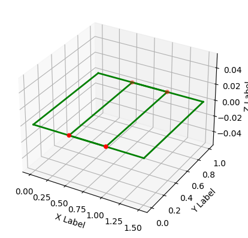
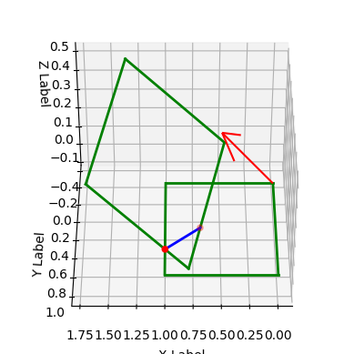
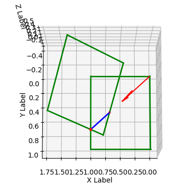

# ThreeDTool


This module is needed to work with mathematical structures such as plane, line, 
triangles and other polygons, polyhedron.

Этот модуль необходим для работы с математическими структурами, такими как плоскость, линия, 
треугольники и другие многоугольники, многогранники.

An example of using the library is here:

Пример использования библиотеки здесь:

https://github.com/OnisOris/5X3D-slicer

# Пример применение модуля

## Установка последней версии ThreeDTool с github.com
Ставим модуль с помощью команды ниже с github


```python
!pip install git+https://github.com/OnisOris/ThreeDTool
```

  
## Анализ положения квадратов
Создадим два квадрата с вершинами [[0, 0, 0], [1, 0, 0], [1, 1, 0], [0, 1, 0]]  и [[1.5, 0, 0], [1.5, 1, 0], [0.5, 1, 0], [0.5, 0, 0]].

Они находятся в одной плоскости и пересекаются. Найдем точки пересечения


```python
import ThreeDTool as tdt
import numpy as np

# Первый прямоугольник состоит из четырех вершин
pol1 = tdt.Polygon(np.array([[0, 0, 0], [1, 0, 0], [1, 1, 0], [0, 1, 0]]))

# Второй прямоугольник состоит тоже из четырех вершин

pol2 = np.array([[1.5, 0, 0], [1.5, 1, 0], [0.5, 1, 0], [0.5, 0, 0]])

# Создадим объект многоугольника, чтобы его можно было отобразить на графике
pol2 = tdt.Polygon(pol2)

# Функция для нахождения пересечений прямоугольников, возвращающая точки
points = pol1.points_from_polygon_polygon_intersection(pol2)

# Создадим объект класс обертку для точек, в него нужно помещать матрицу
# nx3, где n - количество точек
points = tdt.Points(points, s=20, color='red')

# Создадим объект Dspl, который кушает объекты с реализованным методом show(ax)
# и отображает эти объекты, когда применяем метод show к объекту Dspl
dp0 = tdt.Dspl([pol1, pol2, points])

# Отобразим наш график
dp0.show()
```




Для изучения данной функции повернем один из прямоугольников


```python
# Попробуем его покрутить в пространстве по оси [1, 1, 1] на угол в 30 градусов
axis = [1, 1, 1]

# Переопределим вершины прямоугольника
pol2 = np.array([[1.5, 0, 0], [1.5, 1, 0], [0.5, 1, 0], [0.5, 0, 0]])

# Поворот прямоугольника
pol2 = tdt.rot_v(pol2, np.pi/6,  axis)

# Создадим объект многоугольника, чтобы его можно было отобразить на графике
pol2 = tdt.Polygon(pol2)

# Найдем точки пересечения многоугольников
points = pol1.points_from_polygon_polygon_intersection(pol2)
line_s = tdt.Line_segment(point1=points[0], point2=points[1])

# Ось попробуем отобразить с помощью класса Fvec, который хранит в себе координату и вектор вида:
# [x, y, z, px, py, pz]
axis = tdt.Fvec([0, 0, 0], axis)
axis.length = 0.5

# Создадим объект класс обертку для точек, в него нужно помещать матрицу nx3,
# где n - количество точек
points = tdt.Points(points, s=20, color='red')

# Создадим объект Dspl, который кушает объекты с реализованным методом show(ax)
# и отображает эти объекты, когда применяем метод show к объекту Dspl
dp = tdt.Dspl([pol1, pol2, points, line_s, axis])
# Далее мы можем настраивать разные ракурсы графика, eval - угол наклона, axim -
# азимут (Угол между горизонтальной плоскостью меридиана и вертикальной
# плоскостью наблюдаемого объекта)
dp.ax.view_init(elev=40, azim=90)

# Отобразим наш график
dp.show()

```


    

    


Как мы можем видеть, прямоугольники пересеклись в области, указанной синей линией. Красная стрелка показывает ось поворота квадрата, который был до этого в плоскости


```python
# Для повторного отображения необходимо воспользоваться методом
# create_subplot3D()
dp.create_subplot3D()
dp.ax.view_init(elev=80, azim=90)
dp.show()
```


    

    


```python
dp.create_subplot3D()
dp.ax.view_init(elev=00, azim=90)
dp.show()
```


    

    

